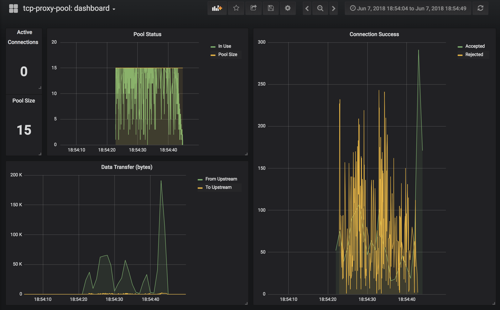

#### Import Dependencies
```bash
dep init

# aws sdk for ecs integration
dep ensure -add github.com/aws/aws-sdk-go@1.13.49

# logging
dep ensure -add github.com/sirupsen/logrus@1.0.5

# command line arguments
dep ensure -add github.com/alecthomas/kingpin@2.2.6

# container management
dep ensure -add github.com/aws/aws-sdk-go-v2
```